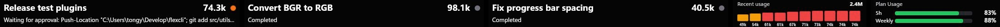

# Flexbar AI Dashboard



Flexbar AI Dashboard is a FlexDesigner v1 plugin that shows local Codex and Claude Code activity on Flexbar keys: session status, token usage, plan usage windows, and skill shortcuts.

It is built for development workflows that use both Codex and Claude Code. You can see which agent is running, which tool it just used, recent token consumption, and remaining plan quota without switching back to the terminal.

## Supported Tools

### Codex

- Sessions and current activity: reads from `codex app-server` first, then falls back to JSONL logs under `$CODEX_HOME/sessions`.
- Token usage: parses `token_count` events from Codex session JSONL files.
- Plan usage: reads rate limits from `codex app-server` when available; otherwise uses the OAuth token in `$CODEX_HOME/auth.json` to query the ChatGPT usage endpoint.
- Skill shortcuts: reads `SKILL.md` files from `$CODEX_HOME/skills` and `$CODEX_HOME/plugins/cache`.

The default `CODEX_HOME` is `~/.codex`. Override it with the `CODEX_HOME` environment variable if needed.

### Claude Code

- Sessions and token usage: reads Claude Code project JSONL logs. Default locations:
  - `~/.config/claude/projects`
  - `~/.claude/projects`
- Live activity and plan windows: uses plugin-installed Claude hooks and statusLine output written to a local bridge file.
- Skill shortcuts: reads `~/.claude/skills`. If `CLAUDE_CONFIG_DIR` is set, the plugin reads `skills` and `projects` from that config directory.

The default bridge file is `~/.flexbar-ai-dashboard/claude-events.jsonl`. Override it with `FLEXBAR_AI_CLAUDE_EVENTS` if needed.

## Flexbar Keys

- **AI Session**: shows a recent active Codex or Claude Code session. The key can be configured by data source and session title mode.
- **Token Usage**: shows observed local token usage. Supports summary mode and recent chart mode.
- **Plan Usage**: shows remaining Codex or Claude Code plan / rate-limit windows.
- **AI Skill**: lets you select a Codex or Claude Code skill. Pressing the key pastes `Use the <skill> skill.` into the current input target.

The plugin includes English and Chinese UI strings and follows the host language where possible.

## References

This plugin does not fork upstream code. It adapts behavior and data formats from these projects and docs:

- [ENIAC-Tech/flexdesigner-sdk](https://github.com/ENIAC-Tech/flexdesigner-sdk): FlexDesigner plugin SDK, `plugin.draw`, lifecycle events, and config page communication.
- [openai/codex](https://github.com/openai/codex): Codex CLI local session behavior, app-server behavior, and token event shape.
- [anthropics/claude-code](https://github.com/anthropics/claude-code): Claude Code local config, skills, and project log conventions.
- [Claude Code hooks docs](https://docs.anthropic.com/en/docs/claude-code/hooks): hook configuration structure in `~/.claude/settings.json`.
- [Claude Code statusLine docs](https://docs.anthropic.com/en/docs/claude-code/statusline): statusLine JSON input via stdin and status text via stdout.

Implementation plans live in `docs/superpowers/plans/`.

## Installation

### Prerequisites

- Node.js 18 or later
- FlexDesigner 1.3.0 or later
- A Flexbar device
- FlexCLI

```bash
npm install -g @eniac/flexcli
```

### Install Dependencies

```bash
git clone <repo-url>
cd flexbar-ai-dashboard
npm install
```

## Development

Start the plugin in development mode:

```bash
npm run dev
```

This command:

- unlinks the old `com.aspen.flexbar-ai-dashboard` plugin
- links `com.aspen.flexbar-ai-dashboard.plugin`
- starts Rollup in watch mode
- restarts the plugin after each build
- opens FlexCLI debug output

To inspect one local snapshot from the command line:

```bash
npm run prototype:once
npm run prototype:json
```

## Maintenance

Common checks:

```bash
npm test
npm run build
npm run plugin:validate
```

If `npm` is not available in the current shell, run the underlying commands directly:

```bash
node --test test/*.test.js
node node_modules/rollup/dist/bin/rollup -c
```

Maintenance map:

- Collector changes: update `test/collectors.test.js`.
- Dashboard view model changes: update `test/dashboardViewModel.test.js`.
- Canvas renderer changes: update `test/dashboardRender.test.js`.
- Flexbar config page changes: update `test/keyConfigPages.test.js`.
- Claude hooks / statusLine setup changes: update `test/claudeBridgeInstall.test.js` and `test/oneClickSetup.test.js`.

## Claude Bridge Setup

Clicking **One-click install** on the global config page will:

- check Codex home, auth, and sessions paths
- install Flexbar-managed Claude hooks into `~/.claude/settings.json`
- write a recorder script to `~/.flexbar-ai-dashboard/`
- install a Flexbar-managed statusLine when the user does not already have one

If the user already has a custom statusLine, the plugin does not overwrite it by default. Use the **Advanced** section to overwrite it.

The **Path overrides** section supports optional overrides for `CODEX_HOME`, `CLAUDE_CONFIG_DIR`, and `FLEXBAR_AI_CLAUDE_EVENTS`. Click **Apply path overrides** to save them into the plugin `config.json` through FlexDesigner (`$fd.setConfig`) after backend validation. On plugin startup the backend reads `config.json` from the plugin directory before resolving Codex or Claude paths, so overrides survive restarts even before the settings UI opens. Codex home must exist, each Claude config root must exist with a `projects` subdirectory, and the Claude bridge path must be a file (existing or creatable under an existing parent directory). Leave a field blank to keep auto-detection from the current environment. Each field placeholder shows the resolved default path.

Clicking **Uninstall config** removes only hooks and statusLine entries managed by this plugin. It does not delete original Codex or Claude Code session data.

## Build and Deploy

Build the backend bundle:

```bash
npm run build
```

Pack the `.flexplugin` artifact:

```bash
npm run plugin:pack
```

Install the packed artifact:

```bash
npm run plugin:install
```

Recommended release checklist:

```bash
npm test
npm run build
npm run plugin:validate
npm run plugin:pack
```

Artifacts:

- Plugin directory: `com.aspen.flexbar-ai-dashboard.plugin`
- Backend entry: `com.aspen.flexbar-ai-dashboard.plugin/backend/plugin.cjs`
- Packed file: `com.aspen.flexbar-ai-dashboard.flexplugin`

## Project Structure

```text
src/
  collectors/      Codex / Claude / skills / setup data collection
  dashboard/       view models, rendering, and config event parsing
  prototype/       CLI snapshots and debug formatting

com.aspen.flexbar-ai-dashboard.plugin/
  manifest.json    FlexDesigner plugin manifest
  ui/              global config page and key config pages
  backend/         Rollup build output

test/              Node test runner tests
docs/              implementation plans and maintenance notes
```

## Notes

- The plugin reads local Codex / Claude Code data only. It does not upload session logs.
- The Codex OAuth token is used locally only for reading plan usage. Tests cover that the token is not exposed.
- The Claude bridge modifies `~/.claude/settings.json`, but entries managed by this plugin are marked with `flexbar-ai-dashboard`, so uninstall removes only those entries.
- On Windows, the Claude bridge recorder uses PowerShell. On macOS / Linux, it uses a Node script.
